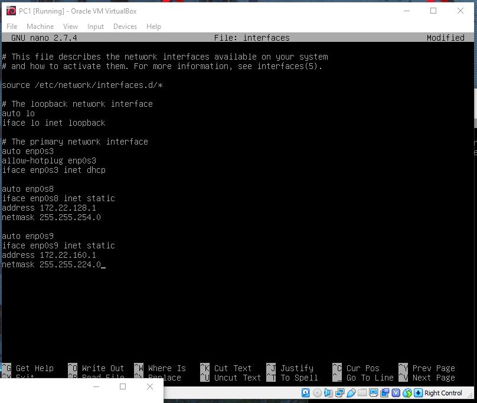
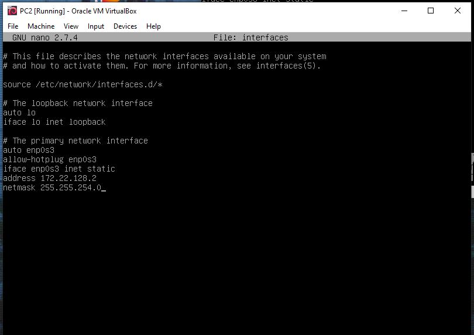
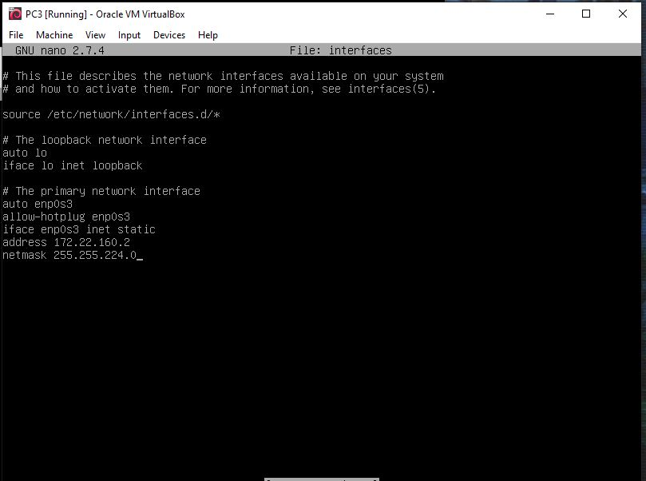
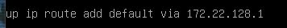
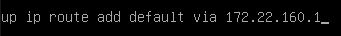
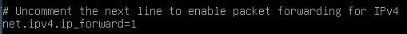
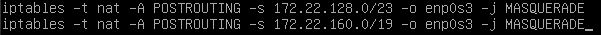
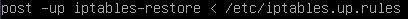
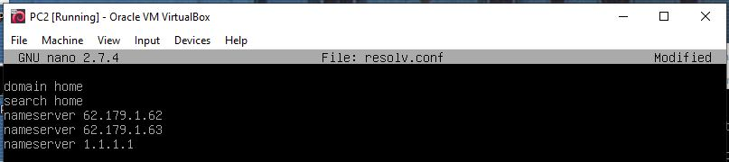

**Pierwszym krokiem jest utworzenie 3 maszyn w środowisku VirtualBox
Wykorzystałem do tego maszynę załączoną na moodlu i opcję clone aby uzyskać 2 pozostałe maszyny**

**Następnie tworzymy dwie sieci typu NAT**

**Wybieramy maski podsieci i adresy IP
Korzystając z tablic dostępnych w internecie możemy sprawdzić jaka maska będzie nam potrzebna**

 Czyli w naszym przypadku będzie to 
 172.22.128.0/19 dla 8190 hostów, aby była możliwość adresacji 5000 urządzań
 172.22.128.0/23 dla 510  hostów, aby była możliwość adresacji 500  urządzeń
 
 
 **PC1** podłączamy do:
 
 karta nr1 - NAT
 
 karta nr2 - LAN1
 
 karta nr3 - LAN2
 
 **PC2** podłączamy do:
 
 karta nr1 -LAN1
 
 **PC3** podłączamy do:
 
 karta nr1 - LAN2
 
 **Konfiguracja sieci:**
 
  **PC1**
  
  
  
  **PC2**
  
  
  
  **PC3**
  
  

**Routing PC2 oraz PC3**

Dodajemy te linijki w /etc/network/interfaces

**PC2**

**PC3**

Następnie sprawdzamy poprawność korzystając z **ip route show**

**Konfiguracja forwardingu na PC1**

w  pliku znajdującym się w ścieżce /etc/sysctl.d w pliku 99-sysctl.conf odkomentować następującą linijkę

**MASQUERADE - PC1**

Ścieżka /etc/ w pliku iptables.up.rules dopisać

Trzeba także ustawić automatyczne wczytywanie tych reguł przy starcie maszyny
Robimy to poprzez edycję pliku interfaces w ścieżce /etc/network/ dopisując

**DNS**

Ostatnim krokiem jest dodanie w pliku resolv.conf w ścieżce /etc/ adresów DNS, w tym przypadku "1.1.1.1"

Zarówno dla PC2 jak i PC3
