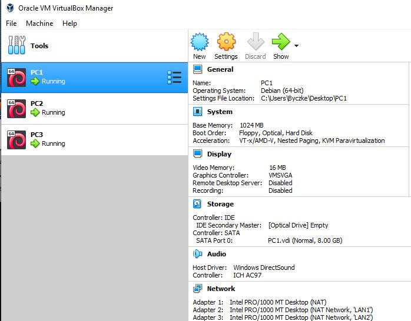
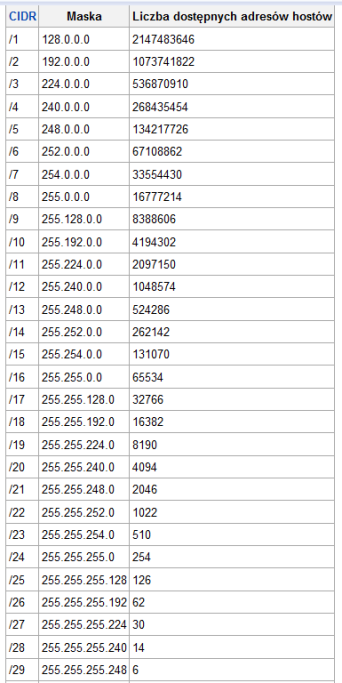

1.
Pierwszym krokiem jest utworzenie 3 maszyn w środowisku VirtualBox
Wykorzystałem do tego maszynę załączoną na moodlu i opcję clone aby uzyskać 2 pozostałe maszyny

-------------------------------
2.
Następnie tworzymy dwie sieci typu NAT

-------------------------------
3.

Wybieramy maski podsieci i adresy IP
Korzystając z tablic dostępnych w internecie możemy sprawdzić jaka maska będzie nam potrzebna

