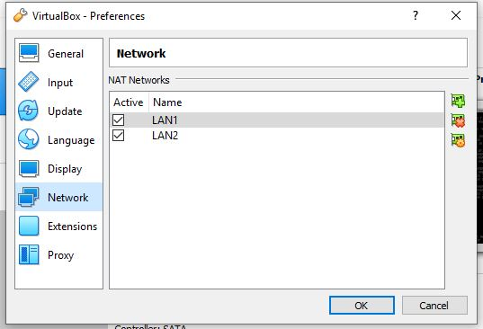

1.
Pierwszym krokiem jest utworzenie 3 maszyn w środowisku VirtualBox
Wykorzystałem do tego maszynę załączoną na moodlu i opcję clone aby uzyskać 2 pozostałe maszyny

-------------------------------
2.
Następnie tworzymy dwie sieci typu NAT

-------------------------------
3.

Wybieramy maski podsieci i adresy IP
Korzystając z tablic dostępnych w internecie możemy sprawdzić jaka maska będzie nam potrzebna

 Czyli w naszym przypadku będzie to 
 172.22.128.0/19 dla 8190 hostów, aby była możliwość adresacji 5000 urządzań
 172.22.128.0/23 dla 510  hostów, aby była możliwość adresacji 500  urządzeń
 
 
 **PC1** podłączamy do:
 karta nr1 - NAT
 karta nr2 - LAN1
 karta nr3 - LAN2
 **PC2** podłączamy do:
 karta nr1 -LAN1
 **PC3** podłączamy do:
 karta nr1 - LAN2
 
 Konfiguracja sieci:
  **PC1**
  
  
  
  **PC2**
  
  
  
  **PC3**
  
  
